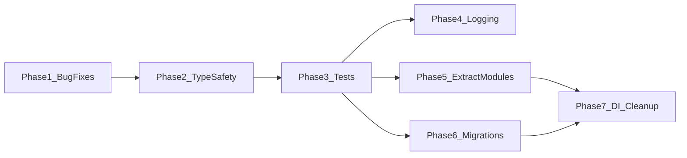

# Angy Orchestrator Hardening Plan

## Guiding Principles

- **Each phase is independently shippable** — you can stop after any phase and the system is strictly better.
- **Phases are ordered by risk** — bug fixes and additive changes first, structural refactors last.
- **Tests precede refactors** — Phase 3 establishes a test harness so that Phases 4-7 have a safety net.
- **No behavioral changes** — all refactors preserve the existing public API and runtime behavior.

---

## Phase 1: Bug Fixes and Silent-Failure Hardening

**Risk: Minimal — fixes existing bugs, no API changes.**

### 1a. Fix duplicated `autoProfilesDetected` handler

In [src/engine/AngyEngine.ts](src/engine/AngyEngine.ts), lines 687-703 register the same event handler twice. Remove the duplicate (lines 696-703).

### 1b. Await fire-and-forget async calls

In [src/engine/ProcessManager.ts](src/engine/ProcessManager.ts), `runAutoCommit()` is called without `await` or `.catch()` (line 291). Wrap it:

```typescript
runAutoCommit(options.workingDir).catch(err =>
  console.error('[ProcessManager] Auto-commit failed:', err),
);
```

Audit all other fire-and-forget patterns — search for async calls without `await` in engine files.

### 1c. Add configuration validation

Create a `validateSchedulerConfig()` function in [src/engine/Scheduler.ts](src/engine/Scheduler.ts) and call it in `loadConfig()` and `saveConfig()`. Clamp dangerous values:

- `tickIntervalMs`: min 5000, max 600000
- `maxConcurrentEpics`: min 1, max 20
- `dailyCostBudget`: min 0
- All weights: min 0, max 1

### 1d. Guard against corrupt DB data in row mappers

In [src/engine/Database.ts](src/engine/Database.ts), the `rowToEpic()` and `rowToSessionInfo()` methods parse JSON without try/catch:

```typescript
dependsOn: JSON.parse(r.depends_on || '[]'),
```

Wrap each `JSON.parse` in a safe helper that returns a default on failure:

```typescript
function safeJsonParse<T>(raw: string | null, fallback: T): T {
  try { return raw ? JSON.parse(raw) : fallback; }
  catch { return fallback; }
}
```

---

## Phase 2: Type Safety Improvements

**Risk: Minimal — compile-time only, no runtime changes.**

### 2a. Narrow string types to union literals

In [src/engine/types.ts](src/engine/types.ts):

- `SessionInfo.mode: string` -> `SessionInfo.mode: 'agent' | 'ask' | 'plan' | 'orchestrator'`

In [src/engine/KosTypes.ts](src/engine/KosTypes.ts), verify all enum-like string fields (`PriorityHint`, `ComplexityEstimate`, `EpicColumn`, `EpicPipelineType`) are used consistently.

### 2b. Remove `as any` casts

In [src/engine/Scheduler.ts](src/engine/Scheduler.ts), `doMoveEpic` casts `column as any`. Fix by accepting `EpicColumn` type directly.

### 2c. Fix the leaky repository abstraction

In [src/engine/AngyEngine.ts](src/engine/AngyEngine.ts), lines 105-106 cast `this.epics as DatabaseEpicRepository` to call `.reload()`. Instead, add `reload(): Promise<void>` to the `EpicRepository` and `ProjectRepository` interfaces in [src/engine/repositories.ts](src/engine/repositories.ts). This makes the abstraction honest without changing behavior.

---

## Phase 3: Test Infrastructure and Initial Tests

**Risk: None — purely additive, no existing code modified.**

### 3a. Install Vitest

```bash
npm install -D vitest
```

Add to `package.json` scripts:

```json
"test": "vitest run",
"test:watch": "vitest"
```

Create `vitest.config.ts` at root with path aliases matching `tsconfig.json`.

### 3b. Write foundational unit tests

Priority test targets (these are pure logic with no Tauri/DOM dependencies):

| File | What to test |

|------|-------------|

| `Scheduler.computePriorityScore()` | Score calculation with various epic inputs |

| `Scheduler.isBlocked()` | Dependency resolution, cycle detection |

| `Orchestrator.buildInitialMessage()` | Static method, all pipeline types |

| `StreamParser` | JSON line parsing, tool extraction |

| `TechDetector` | Tech profile detection from file markers |

| `DiffEngine` | LCS diff computation |

These tests exercise the most critical logic without needing Tauri APIs or mocking the filesystem.

### 3c. Create mock factories

Create `src/engine/__tests__/factories.ts` with helper functions to build `Epic`, `SessionInfo`, `SchedulerConfig` objects with sensible defaults and optional overrides. This avoids verbose test setup.

---

## Phase 4: Structured Logging

**Risk: Low — replaces console calls with a wrapper, same output by default.**

### 4a. Create a Logger utility

Create [src/engine/Logger.ts](src/engine/Logger.ts) with a thin wrapper:

```typescript
export enum LogLevel { DEBUG, INFO, WARN, ERROR }

class Logger {
  constructor(private context: string) {}
  info(msg: string, data?: Record<string, unknown>) { ... }
  warn(msg: string, data?: Record<string, unknown>) { ... }
  error(msg: string, data?: Record<string, unknown>) { ... }
  debug(msg: string, data?: Record<string, unknown>) { ... }
}

export function createLogger(context: string): Logger { ... }
```

Output format: `[LEVEL] [Context] message { key: value }` — structured, filterable, with correlation data (epicId, sessionId).

### 4b. Replace `console.log` calls

Systematically replace `console.log/warn/error` across all engine files with the Logger. Each class gets its own logger instance (e.g., `const log = createLogger('Scheduler')`). This is a mechanical find-and-replace that preserves all existing log messages.

---

## Phase 5: Extract Modules from God Objects

**Risk: Medium — structural refactoring, but tests from Phase 3 provide safety net.**

### 5a. Extract system prompts from Orchestrator

Move the ~250 lines of prompt constants (`ORCHESTRATOR_PREAMBLE`, `SPECIALIST_PROMPTS`, `SPECIALIST_TOOLS`, all workflow strings) from [src/engine/Orchestrator.ts](src/engine/Orchestrator.ts) into a new [src/engine/prompts.ts](src/engine/prompts.ts). The `Orchestrator` class imports from it. Zero behavioral change.

### 5b. Extract git operations from Orchestrator

Move `detectGit()`, `doGitCheckpoint()`, and `executeCheckpoint()` from `Orchestrator` into a new [src/engine/GitCheckpointer.ts](src/engine/GitCheckpointer.ts) class. The `Orchestrator` receives it as a constructor dependency. This also makes git operations independently testable.

### 5c. Split Database into domain modules

Decompose [src/engine/Database.ts](src/engine/Database.ts) into:

- `Database.ts` — connection management, schema creation, migration runner
- `SessionQueries.ts` — session + message + checkpoint CRUD
- `EpicQueries.ts` — epic + branch + project CRUD
- `SchedulerQueries.ts` — config + log + cost CRUD

Each module receives the `SqlDatabase` handle from `Database`. The public API of `Database` re-exports all methods for backward compatibility (no callers need to change).

---

## Phase 6: Database Migration Framework

**Risk: Medium — changes how schema evolves, but preserves existing data.**

### 6a. Create a migration runner

Create [src/engine/migrations.ts](src/engine/migrations.ts):

```typescript
interface Migration {
  version: number;
  name: string;
  up(db: SqlDatabase): Promise<void>;
}
```

Add a `schema_version` table. On startup, run all migrations with `version > current` in order. Wrap each migration in a transaction.

### 6b. Convert existing schema to migration 1

Migration 1 = the current `CREATE TABLE IF NOT EXISTS` + all `ALTER TABLE ADD COLUMN` statements. This is a no-op for existing databases (tables already exist) but provides a clean starting point for new installations.

### 6c. Future migrations get proper versioning

All subsequent schema changes become numbered migration files instead of try/catch ALTER TABLE blocks.

---

## Phase 7: Dependency Injection Cleanup

**Risk: Highest — changes construction and wiring patterns. Do last, with full test coverage.**

### 7a. Replace Scheduler setter injection with constructor params

Change `Scheduler` from:

```typescript
const s = Scheduler.getInstance();
s.setPool(pool);
s.setDatabase(db);
s.setRepositories(epics, projects);
```

To:

```typescript
interface SchedulerDeps {
  pool: OrchestratorPool;
  db: Database;
  epics: EpicRepository;
  projects: ProjectRepository;
}
const s = new Scheduler(deps);
```

Keep `getInstance()` as a convenience that delegates to `AngyEngine` (the composition root), but construction now requires all dependencies upfront — no invalid intermediate states.

### 7b. Same pattern for OrchestratorPool and ProcessManager

Apply the same constructor-injection pattern. The `AngyEngine` constructor becomes the single composition root where all dependencies are wired.

### 7c. Make singletons optional

Keep `AngyEngine.getInstance()` for production convenience, but allow `new AngyEngine(deps)` for testing. Remove singleton pattern from `Scheduler` and `OrchestratorPool` — they become regular classes owned by `AngyEngine`.

---

## Phase Dependency Diagram



Phases 4, 5, and 6 can be done in parallel after Phase 3. Phase 7 depends on both 5 and 6.

---

## Out of Scope (Intentionally Deferred)

- **CI/CD pipeline** — Valuable but orthogonal to code hardening. Can be added at any time.
- **Cross-platform support** — Requires Tauri capability changes and platform testing infrastructure.
- **LLM provider abstraction** — Major architectural change, not a hardening concern.
- **Vue Router adoption** — UI concern, not engine hardening.