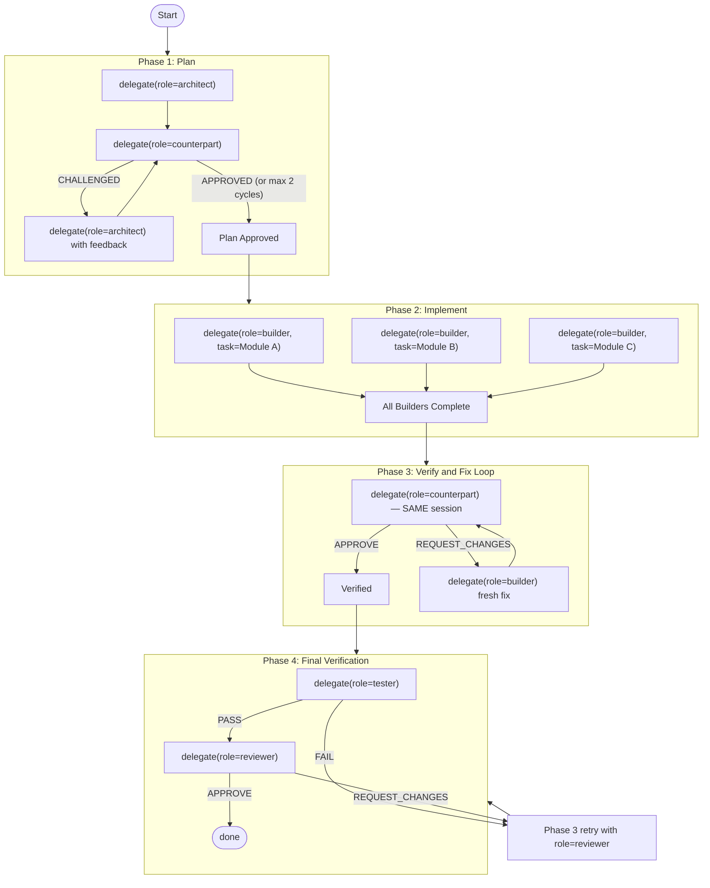

# Add Hybrid Pipeline

## Blast Radius Analysis

The new pipeline type touches exactly **3 files**. Every change is additive (new switch case, new constant, new array element). No existing code paths are modified.

Files that do NOT need changes:

- `resources/mcp/orchestrator_server.py` -- role enum already includes `architect`, `builder`, `counterpart`, `reviewer`, `tester`
- `src/engine/AngyEngine.ts` -- reads `epic.pipelineType` generically, passes to `orch.setPipelineType()`
- `src/engine/OrchestratorPool.ts` -- hybrid is not read-only, existing logic works
- `src/engine/Database.ts` -- `pipeline_type` is TEXT, accepts any string
- `src/engine/ProfileManager.ts` -- prompts loaded from `SPECIALIST_PROMPTS` at delegation time
- `src/stores/epics.ts` -- default stays `'create'`
- `src/components/chat/ChatPanel.vue` -- input-bar only uses `create`/`fix`

## State Machine

The hybrid pipeline follows this precise state machine. The orchestrator LLM must follow these phases in order:



**Key design decisions:**

- **Counterpart is persistent** from Phase 1 plan review through Phase 3 fix loop. It remembers the approved plan and can catch deviations.
- **All builders are fresh.** Each gets only their module's slice of the plan. Clean context, maximum parallelism.
- **Architect is fresh.** If the counterpart rejects the plan, a new architect gets the feedback and revises.
- **Phase 4 retry uses `role="reviewer"`** (not counterpart). This avoids needing a session-reset mechanism. The reviewer is a fresh agent that reviews with the tester's failure output as context. Rationale: if the counterpart approved code that failed testing, its judgment was biased -- a fresh reviewer is more reliable.

## File Changes

### 1. [src/engine/KosTypes.ts](src/engine/KosTypes.ts) -- line 14

Add `'hybrid'` to the union type:

```typescript
export type EpicPipelineType = 'create' | 'fix' | 'investigate' | 'plan' | 'conversational' | 'hybrid';
```

### 2. [src/engine/Orchestrator.ts](src/engine/Orchestrator.ts) -- the critical file

#### 2a. New `HYBRID_WORKFLOW` constant (after `CONVERSATIONAL_WORKFLOW`, ~line 424)

This is the most important piece -- the state machine prompt. It must be precise enough that the orchestrator LLM follows the exact phases. Draft structure:

```
# Hybrid Workflow

4-phase pipeline: Plan → Parallel Implement → Verify/Fix → Final Test.

## IMPORTANT: Role Rules
- **architect** — designs the solution (fresh sessions, read-only)
- **counterpart** — persistent adversarial verifier (same session reused across phases 1-3)
- **builder** — implements code (fresh sessions, one per module, can run in parallel)
- **tester** — builds and runs tests (fresh)
- **reviewer** — final code review (fresh, used for Phase 4 retries)

## Phase 1: Plan
1. delegate(role="architect", task="...") to analyze the codebase and design the solution.
   The architect MUST produce a structured plan with:
   - EXECUTION PLAN: ordered steps grouped by parallelizable modules
   - FILE OWNERSHIP MATRIX: which module owns which files (no overlaps)
   - CONVENTIONS DISCOVERED: patterns builders must follow
   - TRAPS: things builders must NOT do
   - INTEGRATION CONTRACTS: how modules connect (shared APIs, events, imports)

2. Forward the architect's plan to delegate(role="counterpart", task="...").
   The counterpart verifies:
   - Plan covers ALL acceptance criteria
   - No spec deviations
   - Module boundaries have no file ownership overlaps
   - Plan is specific enough for a fresh implementer to follow without ambiguity

3. If counterpart returns CHALLENGED:
   - delegate(role="architect", task="revise plan addressing: [counterpart feedback]")
   - Re-verify with counterpart (max 2 revision cycles)
   - If not approved after 2 cycles, proceed with best available plan

## Phase 2: Implement (parallel)
Split the approved plan by module boundaries. For each module:
- delegate(role="builder", task="[module slice of plan + shared conventions/traps section]")
- Run independent modules IN PARALLEL using multiple delegate() calls in one turn
- Each builder receives ONLY its module's files and steps, plus the shared conventions/traps
- Include the full FILE OWNERSHIP MATRIX so builders know their boundaries

Wait for ALL builders to complete before proceeding.

## Phase 3: Verify and Fix Loop
1. delegate(role="counterpart", task="review all implementations against the approved plan and acceptance criteria. [include builder outputs]")
   The counterpart is the SAME session that verified the plan -- it remembers what was promised.

2. If counterpart returns APPROVE → proceed to Phase 4.

3. If counterpart returns REQUEST_CHANGES:
   - delegate(role="builder", task="fix: [specific issues from counterpart]") — fresh builder(s)
   - delegate(role="counterpart", task="re-review the fixes") — SAME session
   - Max 3 fix cycles. If issues persist after 3 cycles, call fail().

## Phase 4: Final Verification
1. delegate(role="tester", task="build the project and run all tests")
   If tester reports FAIL: delegate fixes to a fresh builder, then delegate to
   role="reviewer" to re-verify, then re-test. Max 2 retry cycles.

2. delegate(role="reviewer", task="final code review against the original requirements")
   If reviewer returns REQUEST_CHANGES: delegate fixes to a fresh builder,
   then re-verify with reviewer. Max 2 retry cycles.

3. When tester passes AND reviewer approves → call done(summary).

## Key Rules
- The architect produces the plan. Builders execute it. The counterpart enforces it.
- The counterpart session persists — it keeps all context from plan review through implementation review.
- Builders are ALWAYS fresh sessions. Never reuse a builder session.
- When splitting work for parallel builders, ensure NO file ownership overlaps.
- Include the conventions/traps section in EVERY builder delegation.
- For Phase 4 retries, use role="reviewer" (not counterpart) for fresh verification.
```

#### 2b. New `ORCHESTRATOR_HYBRID_PROMPT` (after `ORCHESTRATOR_CONVERSATIONAL_PROMPT`, ~line 426)

```typescript
export const ORCHESTRATOR_HYBRID_PROMPT = ORCHESTRATOR_PREAMBLE + ORCHESTRATOR_RULES + ORCHESTRATOR_EXAMPLE + HYBRID_WORKFLOW;
```

Note: includes `ORCHESTRATOR_EXAMPLE` (the create example) because the delegation patterns are compatible.

#### 2c. Update `isPersistentRole()` -- line 489

```typescript
private isPersistentRole(role: string): boolean {
    if (this._pipelineType === 'hybrid') return role === 'counterpart';
    return this._pipelineType === 'conversational' && role === 'builder';
}
```

#### 2d. Update `getSystemPrompt()` -- add case at ~line 1634

```typescript
case 'hybrid':
    prompt = ORCHESTRATOR_HYBRID_PROMPT;
    break;
```

#### 2e. Update `buildInitialMessage()` -- add case at ~line 762

```typescript
case 'hybrid':
    message += `Start by calling delegate(role="architect", task="...") to analyze the codebase and design a structured solution plan with module boundaries, conventions, and integration contracts. ` +
        `After receiving the plan, forward it to a counterpart for adversarial verification against the spec. ` +
        `The counterpart session persists — it will verify the plan AND later review the implementation.\n`;
    break;
```

### 3. [src/components/kanban/EpicDetailPanel.vue](src/components/kanban/EpicDetailPanel.vue) -- UI

#### 3a. Add to `pipelineTypes` array (~line 376)

```typescript
{ value: 'hybrid', label: 'Hybrid' },
```

#### 3b. Add to `pipelineColors` (~line 383)

```typescript
hybrid: 'var(--accent-teal)',
```

#### 3c. Add to `pipelineDescriptions` (~line 391)

```typescript
hybrid: 'Architect → Verify Plan → Parallel Build → Review → Test',
```

## What Makes This Safe

- All changes are **additive**: new constants, new switch cases, new array elements
- **No existing code paths are modified** -- create, fix, investigate, plan, conversational all work identically
- The `isPersistentRole()` change adds a new condition before the existing one -- the `conversational` + `builder` path is untouched
- The hybrid only activates when a user explicitly selects it in the epic UI
- **Graceful degradation**: if run from the UI chat panel (where `sendToChild` is not implemented), the counterpart persistence silently falls through to fresh sessions -- functionally equivalent to create

## Estimated Size

- ~60-70 lines of new prompt text (`HYBRID_WORKFLOW`)
- ~15 lines of code changes across switch statements and `isPersistentRole`
- 3 one-liner additions in the Vue component
- Total: ~85 new/modified lines across 3 files