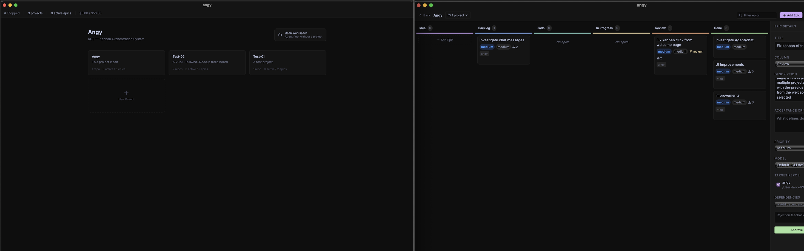
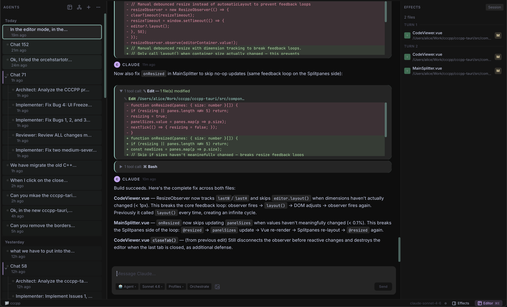

<p align="center">
  
</p>

<h1 align="center">Angy</h1>

<p align="center">A fleet manager for Claude agents. Goals in, working code out.</p>

<p align="center">
  
  
  <a href="LICENSE.md"></a>
</p>

---

Most AI coding tools give you one agent and one conversation. Angy gives you a **command center**.

You define high-level goals called **Epics**. An autonomous scheduler picks them up, spawns an orchestrator per epic, and that orchestrator breaks the work into parallel specialist agents — architects, implementers, reviewers — each running inside a dedicated git branch. When they're done, you approve. Work merges. The scheduler picks the next thing.

No micromanaging. No copy-pasting context. Just goals in, working code out.

<p align="center">
  
</p>

<p align="center">
  
</p>

## Features

### Kanban Board
Epics flow through a visual pipeline:

```
Idea → Backlog → Todo → In Progress → Review → Done
```

Each Epic carries a full spec: title, description, acceptance criteria, priority (critical → low), complexity (trivial → epic), target repositories, and dependencies on other epics. You steer the roadmap; Angy executes it.

### Autonomous Scheduler
A background engine that **continuously prioritizes and dispatches work**:

- Scores Todo epics using configurable weights: priority hint, age, complexity, dependency depth, and rejection penalty
- Respects concurrency limits (e.g. max 3 epics running in parallel)
- Enforces per-repo locks so two epics never write to the same codebase simultaneously
- Skips blocked epics until their dependencies land in Done
- Recovers crashed or interrupted epics automatically on restart
- Tracks daily API cost budgets and pauses when limits are hit

Set it and forget it. Or tune the weights and let it reflect your team's priorities.

### Multi-Agent Orchestration
Each epic gets its own **Orchestrator** — a Claude session restricted to four tools: `delegate`, `validate`, `done`, and `fail`. No file access. Its only job is to decompose the goal and hand work to specialists.

```
Orchestrator (depth 0)
├── delegate → architect-1    analyze codebase, produce a plan
├── delegate → implementer-1  write the code
│   └── spawn_orchestrator    complex sub-task? recurse.
│       ├── delegate → implementer-2
│       └── delegate → reviewer-1
├── validate → run tests, linter, build
└── done → epic moves to Review, branch merges automatically
```

Delegations run **in parallel**. The orchestrator aggregates results and keeps going. Recursion goes up to 3 levels deep by default.

### Git-Native Workflow
Every epic gets its own `epic/{id}` branch per target repository. When the orchestrator calls `done`, the branch is squash-merged into master. The Review column is a human gate before anything lands — you approve, it merges; you reject (with feedback), it goes back to Todo for another attempt.

### Agent Fleet
- **Agent fleet** — spawn, rename, favorite, and remove agents; each has an independent session
- **Parallel delegation** — the orchestrator fans out to multiple specialist agents simultaneously and aggregates their results
- **Agent messaging** — agents on the same team coordinate via a shared inbox
- **Four interaction modes** — `agent` (full tool access), `ask` (read-only), `plan` (plan mode), `orchestrator` (goal delegation)
- **Streaming responses** — real-time token streaming with thinking blocks and tool call visualization
- **Image support** — attach images to messages
- **File checkpointing** — rewind file changes to any prior checkpoint in a session

### Live Observability
Every agent session has its own chat panel, Monaco code editor, and Xterm.js terminal. Watch the fleet work in real time or come back to the Review column when things are done.

- **Integrated editor** — Monaco-based code viewer with syntax highlighting, diff view, inline edit bar, and breadcrumb navigation
- **Integrated terminal** — Xterm.js terminal panel per agent
- **Git integration** — diff tracking and a Git panel in the sidebar
- **Profiles** — configure custom system prompts and tool sets per-profile; stack multiple profiles on an agent
- **Local-first** — everything stored in SQLite on disk; no cloud account required beyond your Claude subscription

## How It Works

1. **Create an epic** — write a title, description, and acceptance criteria on the Kanban board.
2. **Move it to Todo** — the scheduler picks it up on the next tick (default: every 30s).
3. **Scheduler scores and dispatches** — selects the highest-priority unblocked epic, checks repo locks, and spawns an orchestrator.
4. **Orchestrator runs** — Claude decomposes the goal into parallel delegations, validates with shell commands, and calls `done`.
5. **Branch merges** — the epic branch is squash-merged into master.
6. **Review gate** — the epic lands in the Review column. Approve to close it, or reject with feedback to send it back to Todo.

## Installation

### Pre-built Binary (macOS arm64)

If you've cloned the repo, a pre-built binary is available at the repo root:

```bash
chmod +x ./angy_v010
./angy_v010
```

> Note: The binary requires the `resources/` directory to be present alongside it. No standalone release packages are available yet.

### Build from source

**Prerequisites:**

- **Node.js** (LTS recommended)
- **Rust toolchain** — install via [rustup.rs](https://rustup.rs)
- **Claude Code CLI** — must be installed and authenticated (`claude` binary in your PATH)
- **Git** — required for branch management and epic workflows

```bash
# Install dependencies
npm install

# Run in development mode
npm run tauri dev

# Build a production binary
npm run build
```

The production build type-checks, bundles the frontend, and packages a native desktop binary via Tauri. Output is in `src-tauri/target/release/`.

## Configuration

All settings are configurable via the **Settings UI** inside the app.

- **Scheduler** — concurrency limits (max parallel epics), daily API cost budgets, and priority scoring weights (priority hint, age, complexity, dependency depth, rejection penalty)
- **Orchestrator depth** — maximum levels of sub-orchestrator recursion (default: 3)
- **Profiles** — custom system prompts and tool sets per agent profile

## Project Structure

```
src/engine/       Core orchestration engine
                  Orchestrator, Scheduler, BranchManager, ClaudeProcess
src/components/   Vue 3 UI components
                  Kanban board, chat, terminal, Monaco editor
src/composables/  Vue composables
src/stores/       Pinia state management
src-tauri/        Tauri / Rust backend
resources/mcp/    MCP server (Python)
```

## Architecture

Angy wraps the `claude` CLI using Tauri's shell plugin. Each chat session spawns a new `claude` process with `--input-format stream-json` / `--output-format stream-json`, writes a JSON message envelope to stdin, and streams structured JSON events back on stdout.

The **Orchestrator** coordinates multi-agent workflows via an MCP server (`c3p2-orchestrator`) bundled with the app. The orchestrator Claude instance is restricted to four MCP tools — `delegate`, `validate`, `done`, and `fail` — and has no direct file access. Specialist agents (architect, implementer, reviewer, tester) run as normal agent sessions with full tool access.

## Tech stack

| Layer | Technology |
|---|---|
| Desktop shell | [Tauri 2](https://tauri.app) (Rust) |
| Frontend | [Vue 3](https://vuejs.org) + TypeScript |
| Styling | [Tailwind CSS 4](https://tailwindcss.com) |
| State | [Pinia](https://pinia.vuejs.org) |
| Code editor | [Monaco Editor](https://microsoft.github.io/monaco-editor/) |
| Terminal | [Xterm.js](https://xtermjs.org) |
| Syntax highlighting | [Shiki](https://shiki.style) |
| Persistence | SQLite via `@tauri-apps/plugin-sql` |

## Troubleshooting

- **Claude CLI not found** — ensure the `claude` binary is installed and on your PATH. Run `claude --version` to verify.
- **Git not installed** — git is required for branch management. Install it via Xcode Command Line Tools (`xcode-select --install`) or [git-scm.com](https://git-scm.com).
- **MCP server issues** — the bundled MCP server (`resources/mcp/`) requires Python. Check that Python 3 is available and dependencies are installed.
- **Platform support** — Angy is currently macOS-focused. Linux and Windows support is not yet available.

## Status

**v0.1.0** — early, active development. macOS-only for now. Expect breaking changes.

---

> _Managing a fleet of AI agents that autonomously rewrites your codebase while you're away is, frankly, a little terrifying. You should feel something._
